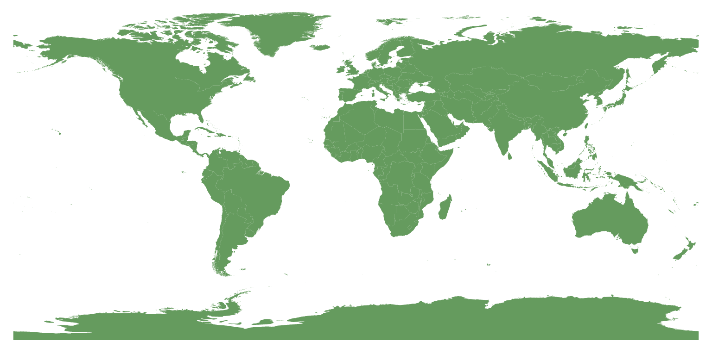

# World Map

A map based on the Puerto Rico Geographic Measurement Method created by me attempting to accurately create a planar representation of the earth without compromising distance or proportions and avoiding the use of integrals. Each unit on the SVG file represents one meter and the method assumes the earth to be perfectly spherical and uses 6371146 meters as the mean-sea-level(I found this value online but I was unable to find a value in a trustworthy website like NASA or Roscosmos), all of the points on the map are assumed to have been taken at sea level height due to the fact that the GeoJSON file only has latitude and longitude values but no altitude.

Hecho en Puerto Rico🇵🇷 por Radamés J. Valentín Reyes

## Picture of the resulting map

## Which problem attempts to address

The problem with map projections stated in a video that I watched a couple of years ago

https://www.youtube.com/watch?v=kIID5FDi2JQ

## Documentation on the method

<a href="./assets/PR_Geo.pdf" download="true">Download the docs(my attempt to explain my idea of transforming the 3d space, placing points in it and measuring distance)</a>

## Library that uses the method to measure distance between coordinates
https://pub.dev/packages/pr_geo

## All of the coordinates required to create this map were taken from this marvelous resource
https://hub.arcgis.com/datasets/2b93b06dc0dc4e809d3c8db5cb96ba69_0/explore?location=-2.688200%2C0.000000%2C1.23

## How was this map generated

This repository contains the HTML, CSS and JavaScript files used to turn the .geojson file into an SVG file. Simply download this repository and open the index.html to have the software generate the SVG and you'll be able to see the SVG file and see the country name on the lower left corner of the screen when hovering a country

## Reference material used in the creation of  this project

- https://webdesign.tutsplus.com/tutorials/svg-viewport-and-viewbox-for-beginners--cms-30844
- https://www.w3schools.com/graphics/svg_intro.asp

